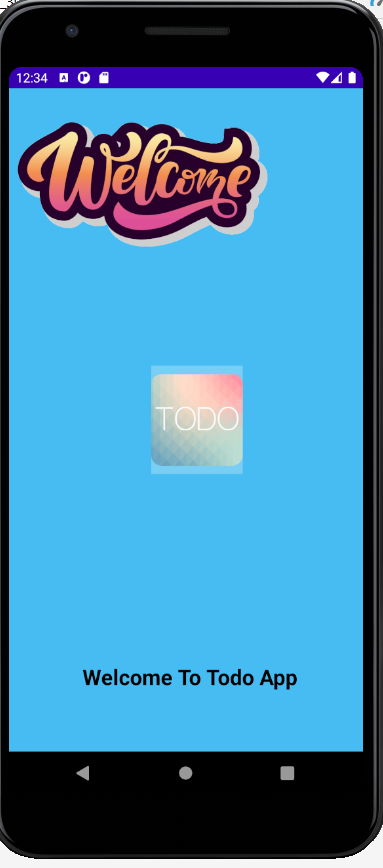

# TODOFINAL
<b>TODO APP</b>
 

 
<b>WELCOME</b>
 

 
<b>USER LOGIN </b>
 

 
<b>Title, Description, Date</b>
 

 
<b>TODO APP WELCOME GIF</b>
 

<b>USER LOGIN</b>
 

<b>TODO LIST ADD</b>
 

<b>TODO LIST</b>
 

<b>TODO LIST SINGLE LIST DELETE</b>
 

<b>TODO LIST COMPLETED LIST DELETE</b>
 

<b>TODO LIST ALL DELETE</b>
 

<b>USERLOGOUT</b>
 

